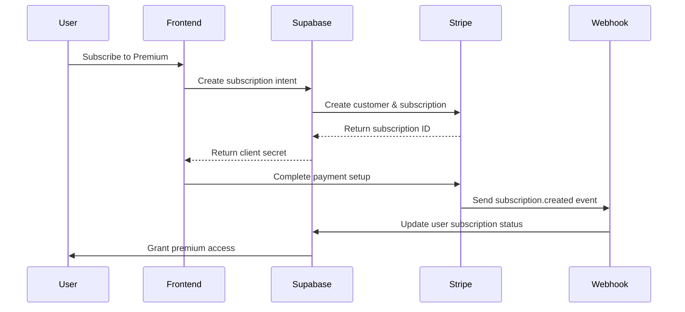

# Payment Processing System Design

## Overview

This document outlines the technical design for implementing a per-user monthly subscription payment system for the Earmark CPE podcast platform. The system will integrate with a payment provider to handle recurring billing while managing user access control based on subscription status.

## High-Level Payment Flow



## Payment Provider Selection

### Recommended: Stripe

**Rationale:**
- **Mature subscription management**: Robust recurring billing, proration, trial periods
- **Strong security**: PCI DSS compliant, tokenization, fraud prevention
- **Developer experience**: Excellent APIs, webhooks, and documentation
- **Supabase compatibility**: Well-documented integration patterns
- **Global reach**: Supports 40+ countries and multiple currencies

**Alternative Considerations:**
- **PayPal**: Good for users preferring PayPal accounts
- **Paddle**: Merchant of record model, handles tax compliance
- **LemonSqueezy**: Simplified setup for SaaS products

## Database Schema Changes

### New Tables

```sql
-- User subscriptions table
CREATE TABLE user_subscriptions (
    id UUID PRIMARY KEY DEFAULT uuid_generate_v4(),
    user_id UUID NOT NULL REFERENCES users(id) ON DELETE CASCADE,
    stripe_customer_id TEXT NOT NULL,
    stripe_subscription_id TEXT UNIQUE,
    status TEXT NOT NULL CHECK (status IN ('active', 'canceled', 'past_due', 'unpaid', 'trialing')),
    current_period_start TIMESTAMP WITH TIME ZONE,
    current_period_end TIMESTAMP WITH TIME ZONE,
    cancel_at_period_end BOOLEAN DEFAULT FALSE,
    trial_end TIMESTAMP WITH TIME ZONE,
    created_at TIMESTAMP WITH TIME ZONE DEFAULT NOW(),
    updated_at TIMESTAMP WITH TIME ZONE DEFAULT NOW()
);

-- Subscription plans table
CREATE TABLE subscription_plans (
    id UUID PRIMARY KEY DEFAULT uuid_generate_v4(),
    name TEXT NOT NULL,
    stripe_price_id TEXT NOT NULL UNIQUE,
    amount_cents INTEGER NOT NULL,
    currency TEXT NOT NULL DEFAULT 'usd',
    interval TEXT NOT NULL CHECK (interval IN ('month', 'year')),
    active BOOLEAN DEFAULT TRUE,
    features JSONB,
    created_at TIMESTAMP WITH TIME ZONE DEFAULT NOW(),
    updated_at TIMESTAMP WITH TIME ZONE DEFAULT NOW()
);

-- Payment events log for audit trail
CREATE TABLE payment_events (
    id UUID PRIMARY KEY DEFAULT uuid_generate_v4(),
    user_id UUID REFERENCES users(id),
    stripe_event_id TEXT NOT NULL UNIQUE,
    event_type TEXT NOT NULL,
    event_data JSONB NOT NULL,
    processed BOOLEAN DEFAULT FALSE,
    created_at TIMESTAMP WITH TIME ZONE DEFAULT NOW()
);
```

### Indexes and Constraints

```sql
-- Performance indexes
CREATE INDEX idx_user_subscriptions_user_id ON user_subscriptions(user_id);
CREATE INDEX idx_user_subscriptions_status ON user_subscriptions(status);
CREATE INDEX idx_user_subscriptions_stripe_customer ON user_subscriptions(stripe_customer_id);
CREATE INDEX idx_payment_events_user_id ON payment_events(user_id);
CREATE INDEX idx_payment_events_processed ON payment_events(processed);

-- RLS policies
ALTER TABLE user_subscriptions ENABLE ROW LEVEL SECURITY;
ALTER TABLE payment_events ENABLE ROW LEVEL SECURITY;

CREATE POLICY "users_view_own_subscription" ON user_subscriptions
    FOR SELECT USING (owns_record_as_user(user_id));

CREATE POLICY "users_view_own_payment_events" ON payment_events
    FOR SELECT USING (owns_record_as_user(user_id));
```

## Subscription Management Strategy

### Subscription Lifecycle

1. **Free Trial (Optional)**
   - 7-day free trial for new users
   - No payment method required upfront
   - Convert to paid after trial

2. **Active Subscription**
   - Monthly recurring billing
   - Full access to premium features
   - Automatic renewal

3. **Grace Period**
   - 3-day grace period for failed payments
   - User retains access during grace period
   - Email notifications for payment issues

4. **Cancellation**
   - Cancel at period end (prorated refunds if applicable)
   - Immediate cancellation option
   - Retain access until period ends

### Subscription States

```typescript
enum SubscriptionStatus {
  TRIALING = 'trialing',
  ACTIVE = 'active',
  PAST_DUE = 'past_due',
  CANCELED = 'canceled',
  UNPAID = 'unpaid'
}
```

## Access Control Implementation

### Database Functions

```sql
-- Check if user has active subscription
CREATE OR REPLACE FUNCTION has_active_subscription(user_uuid UUID)
RETURNS BOOLEAN AS $$
BEGIN
    RETURN EXISTS (
        SELECT 1 FROM user_subscriptions 
        WHERE user_id = user_uuid 
        AND status IN ('active', 'trialing')
        AND (current_period_end IS NULL OR current_period_end > NOW())
    );
END;
$$ LANGUAGE plpgsql STABLE;

-- Get user subscription status
CREATE OR REPLACE FUNCTION get_user_subscription_status(user_uuid UUID)
RETURNS TEXT AS $$
DECLARE
    sub_status TEXT;
BEGIN
    SELECT status INTO sub_status
    FROM user_subscriptions 
    WHERE user_id = user_uuid
    ORDER BY created_at DESC
    LIMIT 1;
    
    RETURN COALESCE(sub_status, 'none');
END;
$$ LANGUAGE plpgsql STABLE;
```

### RLS Policies for Premium Content

```sql
-- Premium courses access
CREATE POLICY "premium_courses_access" ON courses
    FOR SELECT USING (
        NOT premium OR has_active_subscription(auth.uid())
    );

-- Premium episodes access  
CREATE POLICY "premium_episodes_access" ON episodes
    FOR SELECT USING (
        NOT premium OR has_active_subscription(auth.uid())
    );
```

### Application-Level Access Control

```typescript
// Middleware for API routes
export const requireActiveSubscription = async (req, res, next) => {
  const user = req.user; // From auth middleware
  const hasSubscription = await supabase.rpc('has_active_subscription', {
    user_uuid: user.id
  });
  
  if (!hasSubscription.data) {
    return res.status(403).json({ 
      error: 'Active subscription required',
      upgrade_url: '/pricing'
    });
  }
  
  next();
};
```

## Subscription Lifecycle Events

### Webhook Event Handlers

```typescript
// Stripe webhook handlers
const webhookHandlers = {
  'customer.subscription.created': async (subscription) => {
    await supabase.from('user_subscriptions').insert({
      user_id: subscription.metadata.user_id,
      stripe_customer_id: subscription.customer,
      stripe_subscription_id: subscription.id,
      status: subscription.status,
      current_period_start: new Date(subscription.current_period_start * 1000),
      current_period_end: new Date(subscription.current_period_end * 1000),
    });
  },

  'customer.subscription.updated': async (subscription) => {
    await supabase
      .from('user_subscriptions')
      .update({
        status: subscription.status,
        current_period_start: new Date(subscription.current_period_start * 1000),
        current_period_end: new Date(subscription.current_period_end * 1000),
        cancel_at_period_end: subscription.cancel_at_period_end,
      })
      .eq('stripe_subscription_id', subscription.id);
  },

  'customer.subscription.deleted': async (subscription) => {
    await supabase
      .from('user_subscriptions')
      .update({ status: 'canceled' })
      .eq('stripe_subscription_id', subscription.id);
  },

  'invoice.payment_failed': async (invoice) => {
    // Handle failed payment - send notification, update status
    await supabase
      .from('user_subscriptions')
      .update({ status: 'past_due' })
      .eq('stripe_subscription_id', invoice.subscription);
  }
};
```

### Event Processing

1. **Payment Success**
   - Update subscription status to 'active'
   - Extend access period
   - Send confirmation email

2. **Payment Failure**
   - Update status to 'past_due'
   - Send payment failure notification
   - Retry payment (Stripe handles automatically)

3. **Subscription Cancellation**
   - Update status to 'canceled'
   - Maintain access until period end
   - Send cancellation confirmation

## Implementation Plan

### Phase 1: Foundation (Week 1-2)
- [ ] Set up Stripe account and API keys
- [ ] Create database schema and migrations
- [ ] Implement basic webhook handling
- [ ] Create subscription management functions

### Phase 2: Core Features (Week 3-4)
- [ ] Implement subscription creation flow
- [ ] Build customer portal integration
- [ ] Add access control middleware
- [ ] Create subscription status checking

### Phase 3: User Experience (Week 5-6)
- [ ] Build pricing page and checkout flow
- [ ] Implement subscription management UI
- [ ] Add payment method updating
- [ ] Create billing history display

### Phase 4: Advanced Features (Week 7-8)
- [ ] Implement trial periods
- [ ] Add proration handling
- [ ] Create dunning management
- [ ] Build analytics and reporting

## Security Considerations

### Payment Data
- **Never store payment details**: Use Stripe's tokenization
- **Webhook verification**: Verify webhook signatures
- **PCI compliance**: Leverage Stripe's PCI-compliant infrastructure

### Access Control
- **RLS policies**: Database-level access control
- **JWT validation**: Verify user authentication
- **Rate limiting**: Prevent API abuse

### Data Protection
- **Encryption**: Encrypt sensitive subscription data
- **Audit logging**: Log all payment events
- **GDPR compliance**: Handle data deletion requests

## Monitoring and Analytics

### Key Metrics
- Monthly Recurring Revenue (MRR)
- Churn rate
- Customer Lifetime Value (CLV)
- Failed payment rates

### Monitoring Setup
```typescript
// Subscription metrics
const trackSubscriptionEvent = async (event, userId, metadata) => {
  await analytics.track({
    userId,
    event,
    properties: {
      ...metadata,
      timestamp: new Date().toISOString()
    }
  });
};
```

## Testing Strategy

### Unit Tests
- Subscription status checking functions
- Access control middleware
- Webhook event handlers

### Integration Tests
- End-to-end subscription flow
- Webhook processing
- Access control verification

### Load Testing
- Webhook endpoint performance
- Database query optimization
- Payment processing under load

## Rollout Strategy

1. **Beta Testing**: Internal team and select users
2. **Gradual Rollout**: 10% → 50% → 100% of users
3. **Feature Flags**: Toggle subscription features
4. **Monitoring**: Track metrics and errors closely

## Cost Estimation

### Stripe Fees
- **2.9% + $0.30** per successful transaction
- **0.5%** additional for international cards
- **$0.25** per failed payment attempt

### Monthly Projections (1000 subscribers @ $29/month)
- **Revenue**: $29,000
- **Stripe fees**: ~$870 (3%)
- **Net revenue**: ~$28,130

This design provides a robust foundation for implementing subscription-based payments while maintaining security, scalability, and user experience best practices.
